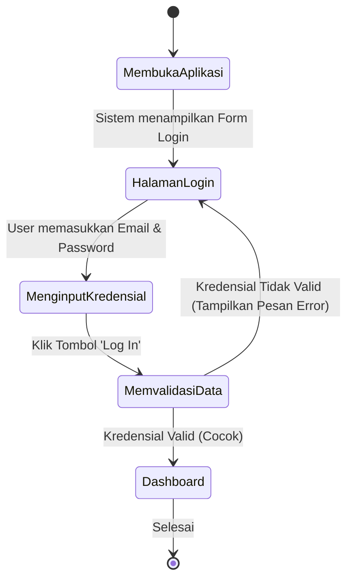
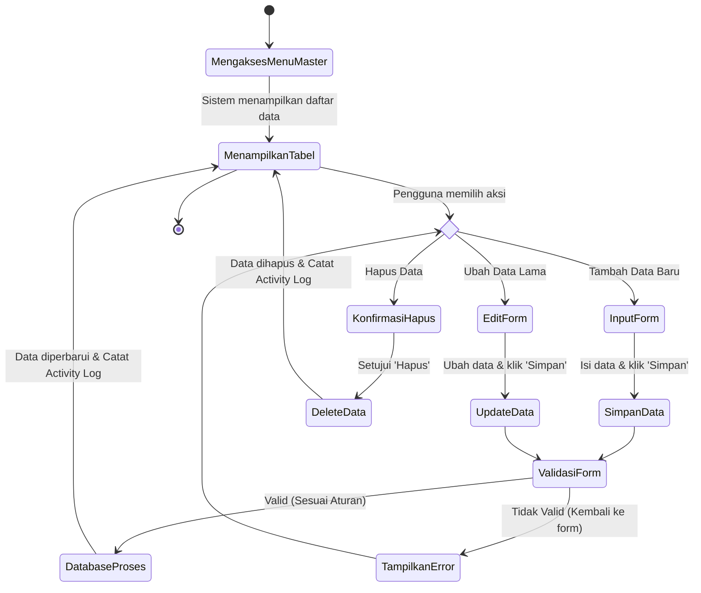
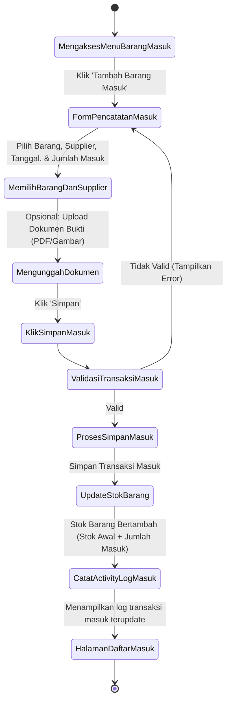
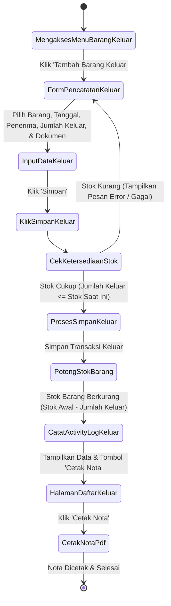
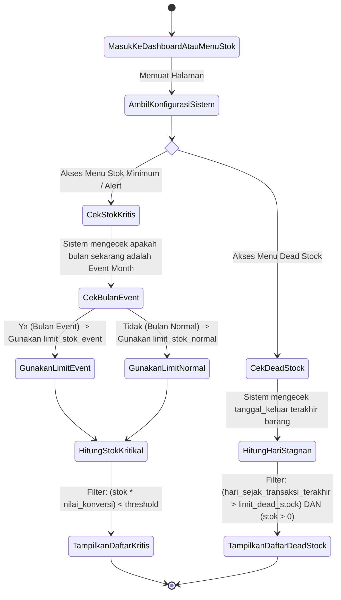
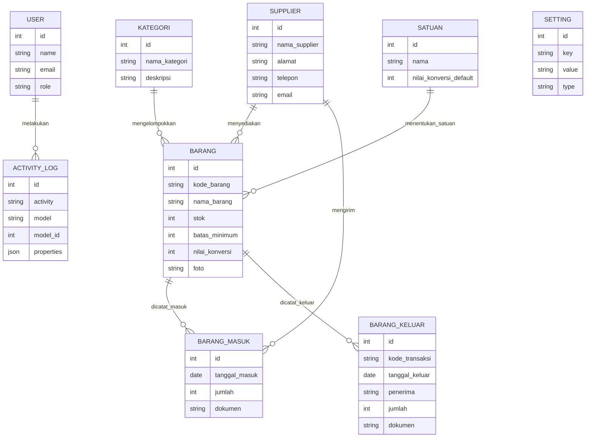
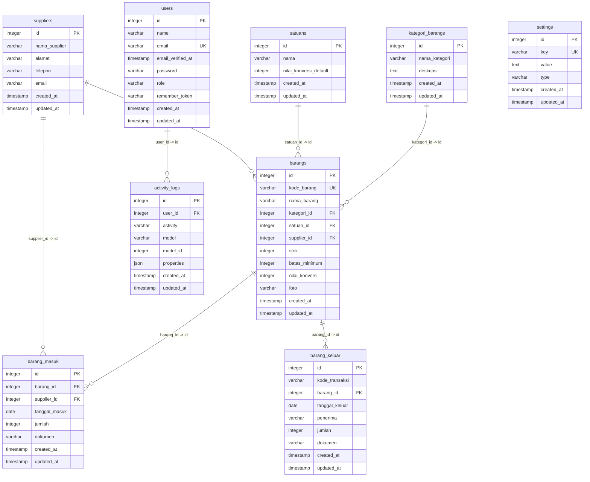

# REVISI LAPORAN TUGAS AKHIR / SKRIPSI
## PROJECT: Sistem Manajemen Gudang (SiGudang)

Dokumen ini berisi draf materi revisi laporan untuk dimasukkan ke dalam dokumen Tugas Akhir/Skripsi Anda. Seluruh konten disesuaikan dengan kondisi riil kode program dan database yang ada pada proyek **SiGudang** (Laravel 11 + Inertia.js React + SQLite).

---

## DAFTAR ISI REVISI
1. **[BAB III] Perancangan Sistem: Activity Diagram** (Menambahkan diagram aktivitas)
2. **[BAB III] Perancangan Database: ERD & Relasi Tabel** (Urutan: ERD konseptual dahulu, baru Relasi Tabel fisik)
3. **[BAB IV] Implementasi Sistem** (Menyesuaikan dengan Laravel, React-Inertia, dan logika stok kritis/dead stock)
4. **[BAB V] Pengujian Sistem** (Tabel Pengujian Black-Box & Pengujian Otomatis)
5. **[BAB VI] Kesimpulan & Saran** (Kesimpulan fitur & pengujian, serta Saran khusus pengembangan)

---

## 1. PERANCANGAN SISTEM: ACTIVITY DIAGRAM

Activity diagram menggambarkan aliran kerja (workflow) atau aktivitas dari berbagai fitur utama dalam sistem **SiGudang** yang melibatkan aktor **Admin** dan **Super Admin**.

### A. Activity Diagram: Autentikasi (Login Sistem)
Menggambarkan alur masuk pengguna (Admin / Super Admin) ke dalam sistem.



**Deskripsi Alur:**
1. Pengguna membuka aplikasi SiGudang melalui web browser.
2. Sistem menampilkan halaman utama/form login.
3. Pengguna menginputkan alamat email dan password yang terdaftar, lalu menekan tombol login.
4. Sistem memvalidasi kredensial ke database.
5. Jika data tidak cocok, sistem mengembalikan pengguna ke halaman login dengan menampilkan pesan error.
6. Jika data cocok, sistem akan mengarahkan pengguna masuk ke halaman Dashboard sesuai dengan role masing-masing (Admin / Super Admin).

---

### B. Activity Diagram: Mengelola Data Master (Barang, Kategori, Satuan, Supplier)
Menggambarkan alur ketika Admin atau Super Admin melakukan operasi CRUD pada data master.



**Deskripsi Alur:**
1. Pengguna masuk ke menu Master Data (misal: Data Barang).
2. Sistem menampilkan tabel daftar data saat ini yang diambil dari database.
3. Pengguna memilih salah satu aksi: Tambah, Edit, atau Hapus.
4. Pada aksi **Tambah/Edit**, sistem menampilkan form input. Pengguna mengisi data dan mengirimkannya.
5. Sistem memvalidasi input. Jika tidak valid (misal: kode barang duplikat atau kolom kosong), sistem menampilkan pesan kesalahan.
6. Jika valid, sistem menyimpan/memperbarui data ke database, dan **secara otomatis mencatat aktivitas tersebut ke dalam tabel Activity Log**.
7. Pada aksi **Hapus**, setelah konfirmasi disetujui, sistem menghapus data, mencatat ke Activity Log, dan menampilkan kembali tabel data yang telah diperbarui.

---

### C. Activity Diagram: Transaksi Barang Masuk (Stok Bertambah)
Menggambarkan alur pencatatan barang yang masuk ke gudang dari supplier.



**Deskripsi Alur:**
1. Pengguna mengakses menu Transaksi Barang Masuk.
2. Pengguna mengklik tombol "Tambah Barang Masuk" sehingga sistem menampilkan form pencatatan.
3. Pengguna memilih barang dari database, memilih supplier terkait, menginput tanggal masuk, memasukkan jumlah barang, serta mengunggah file dokumen pendukung (opsional).
4. Pengguna mengklik tombol simpan, kemudian sistem memvalidasi inputan.
5. Jika valid, sistem menyimpan data transaksi masuk dan secara otomatis **menambahkan jumlah stok pada tabel barang** (`stok_baru = stok_lama + jumlah_masuk`).
6. Sistem mencatat transaksi ini ke tabel `activity_logs` dan menampilkan halaman daftar barang masuk.

---

### D. Activity Diagram: Transaksi Barang Keluar (Stok Berkurang)
Menggambarkan alur pengeluaran barang dari gudang, validasi ketersediaan stok, dan cetak nota.



**Deskripsi Alur:**
1. Pengguna membuka menu Transaksi Barang Keluar dan mengklik tambah.
2. Pengguna memasukkan kode transaksi (terisi otomatis/manual), memilih barang, menentukan tanggal keluar, menginput nama penerima, memasukkan jumlah keluar, serta mengunggah dokumen pendukung (opsional).
3. Sebelum menyimpan, sistem melakukan pemeriksaan: **Apakah jumlah pengeluaran melebihi stok barang yang ada saat ini?**
4. Jika stok tidak mencukupi, sistem menolak penyimpanan dan menampilkan pesan error stok kurang.
5. Jika stok mencukupi, sistem memproses transaksi, **mengurangi stok barang terkait** (`stok_baru = stok_lama - jumlah_keluar`), mencatat ke Activity Log, dan mengarahkan ke halaman daftar barang keluar.
6. Dari halaman daftar, pengguna dapat memilih transaksi tertentu lalu mengklik tombol "Cetak Nota" untuk menghasilkan cetak PDF nota barang keluar.

---

### E. Activity Diagram: Pemantauan Stok Kritis & Dead Stock
Menggambarkan alur otomatis sistem dalam menyajikan alert peringatan stok minimum (kritis) dan barang yang tidak laku/mengendap (dead stock).



**Deskripsi Alur:**
1. Pengguna masuk ke halaman Dashboard, Menu Stok Minimum, atau Menu Dead Stock.
2. **Untuk Stok Minimum (Stok Kritis):**
   - Sistem mengambil konfigurasi `event_months` dari database untuk melihat apakah bulan saat ini termasuk bulan ramai (event).
   - Jika Ya, sistem menetapkan ambang batas default global dari variabel `limit_stok_event` (misal: 50 unit). Jika Tidak, menggunakan `limit_stok_normal` (misal: 10 unit).
   - Namun, jika pada barang tersebut diinput nilai `batas_minimum` spesifik secara manual, maka sistem akan menggunakan nilai `batas_minimum` tersebut (dikalikan dengan `nilai_konversi` barang) sebagai ambang batas.
   - Sistem memfilter dan menyajikan barang-barang yang jumlah stoknya (setelah dikonversi ke unit terkecil) berada di bawah ambang batas kritis tersebut.
3. **Untuk Dead Stock (Stok Mengendap):**
   - Sistem mengambil batas hari stagnan dari konfigurasi `limit_dead_stock` (misal: 30 hari).
   - Sistem melacak tanggal transaksi keluar terakhir untuk masing-masing barang.
   - Sistem menyaring dan menampilkan barang dengan stok > 0 yang tidak pernah mengalami transaksi keluar (stagnan) melebihi batas hari konfigurasi.

---

## 2. PERANCANGAN DATABASE: ERD & RELASI TABEL

Berdasarkan revisi **"ERD dulu baru Relasi Tabel"**, sub-bab ini menyajikan rancangan konseptual (ERD) terlebih dahulu yang berfokus pada hubungan antar entitas bisnis, dilanjutkan dengan perancangan fisik database berupa Relasi Tabel (Logical/Physical Database Model) lengkap dengan tipe data dan kunci (keys).

### A. Entity Relationship Diagram (ERD) - Konseptual
ERD konseptual berfokus pada entitas, atribut utama, serta derajat relasi (kardinalitas) tanpa memperlihatkan detail teknis seperti tipe data atau kolom bawaan framework (seperti `created_at` atau `updated_at`).



**Penjelasan Kardinalitas Relasi Konseptual:**
1. **Kategori ke Barang (1:N / One-to-Many):** Satu Kategori dapat mengelompokkan banyak Barang. Satu Barang hanya termasuk dalam satu Kategori.
2. **Satuan ke Barang (1:N / One-to-Many):** Satu Satuan dapat digunakan oleh banyak Barang. Satu Barang hanya memiliki satu Satuan utama.
3. **Supplier ke Barang (1:N / One-to-Many):** Satu Supplier dapat menyuplai banyak jenis Barang. Satu Barang diasosiasikan dengan satu Supplier utama.
4. **Supplier ke Barang Masuk (1:N / One-to-Many):** Satu Supplier dapat terlibat dalam banyak transaksi Barang Masuk.
5. **Barang ke Barang Masuk (1:N / One-to-Many):** Satu Barang dapat dicatat masuk berulang kali melalui berbagai transaksi Barang Masuk.
6. **Barang ke Barang Keluar (1:N / One-to-Many):** Satu Barang dapat dicatat keluar berulang kali dalam berbagai transaksi Barang Keluar.
7. **User ke Activity Log (1:N / One-to-Many):** Satu User (Admin/Super Admin) dapat melakukan banyak aktivitas yang terekam di dalam Log Aktivitas Sistem.

---

### B. Relasi Tabel (Physical Database Schema)
Bagian ini menunjukkan visualisasi fisik tabel-tabel di dalam database SQLite beserta tipe data kolom, Primary Key (PK), Foreign Key (FK), dan relasi fisiknya.



**Penjelasan Relasi Fisik Database:**
*   Tabel `barangs` memiliki foreign key `kategori_id` yang merujuk pada `id` di tabel `kategori_barangs`, `satuan_id` merujuk ke tabel `satuans`, dan `supplier_id` merujuk ke tabel `suppliers`.
*   Tabel `barang_masuk` memiliki foreign key `barang_id` yang merujuk ke `id` di tabel `barangs` dan `supplier_id` merujuk ke `id` di tabel `suppliers` untuk memperjelas asal barang masuk tersebut.
*   Tabel `barang_keluar` memiliki foreign key `barang_id` yang merujuk ke `id` di tabel `barangs`. Dilengkapi dengan kolom data riil seperti `kode_transaksi` dan nama `penerima`.
*   Tabel `activity_logs` memiliki foreign key `user_id` yang merujuk ke `id` di tabel `users` untuk mencatat siapa pelaku aktivitas tersebut dengan relasi `onDelete('cascade')`.

---

## 3. IMPLEMENTASI SISTEM

Bab ini menguraikan implementasi perangkat lunak dari sistem **SiGudang**.

### A. Lingkungan Implementasi (Tech Stack)
Aplikasi ini dikembangkan dan dijalankan pada lingkungan berikut:
*   **Bahasa Pemrograman Backend:** PHP 8.2+
*   **Framework Backend:** Laravel 11.x (dilengkapi Eloquent ORM, DB Migrations)
*   **Library Frontend:** React.js (React 18)
*   **Penghubung (Bridge):** Inertia.js (React Adapter) - menghilangkan kebutuhan pembuatan REST API terpisah, sehingga data dilewatkan langsung dari Controller Laravel sebagai React Props.
*   **CSS Framework:** Tailwind CSS (untuk antarmuka responsif dan modern)
*   **Database Engine:** SQLite (menggunakan file `database.sqlite` lokal untuk portabilitas dan kecepatan pengembangan)
*   **Library Visualisasi:** Recharts (untuk grafik statistik di Halaman Dashboard)
*   **Library Ikon:** Lucide React

### B. Struktur Kode dan Aliran Kerja (Inertia.js React)
Arsitektur aplikasi menggunakan pola MVC (Model-View-Controller) dengan integrasi Inertia.js:
1.  **Routing (`routes/web.php`):** Mendefinisikan endpoint web yang dilindungi oleh middleware `auth` (harus login terlebih dahulu). Beberapa route tertentu dibatasi khusus bagi peran `superadmin` menggunakan middleware `role:superadmin`.
2.  **Controller (`app/Http/Controllers/`):** Mengambil data dari database melalui model Eloquent, melakukan pemrosesan logika bisnis, dan mengembalikan render Inertia ke frontend React. Contoh:
    ```php
    return Inertia::render('Barang/Index', [
        'barang' => $barangList
    ]);
    ```
3.  **View Component (`resources/js/Pages/`):** React menerima data dari controller sebagai `props` dan merendernya ke layar pengguna secara dinamis tanpa reload halaman penuh (Single Page Application feel).

### C. Implementasi Logika Bisnis Utama

#### 1. Algoritma Deteksi Stok Kritis (Stok Minimum)
Logika deteksi stok kritis diimplementasikan pada `StokMinimumController` dengan membandingkan stok riil setelah dikonversi ke unit terkecil terhadap ambang batas dinamis.
*   **Formula Konversi Stok:** `totalUnitSaatIni = stok * nilai_konversi`
*   **Pengecekan Ambang Batas (Threshold):**
    *   Jika barang memiliki `batas_minimum` spesifik (> 0), threshold = `batas_minimum * nilai_konversi`.
    *   Jika `batas_minimum = 0`, threshold = `limitDefault` (diambil dari pengaturan global: `limit_stok_event` jika bulan saat ini adalah bulan event, atau `limit_stok_normal` jika normal).
*   **Kondisi Stok Kritis:** `totalUnitSaatIni < threshold`

#### 2. Algoritma Dead Stock (Barang Stagnan)
Logika penyaringan dead stock diimplementasikan pada `DeadStockController` untuk mendeteksi barang yang mengendap di gudang.
*   Sistem mencari tanggal keluar terakhir dari tabel `barang_keluar` untuk barang tertentu.
*   Jika belum pernah ada transaksi keluar, selisih hari di-set secara default ke `999` hari.
*   Jika ada transaksi, sistem menghitung selisih hari (`selisihHari = tanggal_hari_ini - tanggal_keluar_terakhir`).
*   Barang masuk kategori **Dead Stock** jika `selisihHari > limit_dead_stock` (dari tabel `settings`, default 30 hari) **DAN** `stok_barang > 0`.

---

## 4. PENGUJIAN SISTEM (TESTING)

Pengujian sistem dilakukan dengan menggunakan dua metode: **Black-Box Testing** untuk menguji fungsionalitas antarmuka dan alur bisnis sistem secara manual, serta **Automated Integration Testing** (menggunakan PHPUnit bawaan Laravel) untuk fitur keamanan dasar.

### A. Tabel Hasil Pengujian Black-Box (Riil & Detail)

| No. | Skenario / Fitur Uji | Tindakan / Input | Hasil yang Diharapkan | Hasil Pengujian | Status |
|---|---|---|---|---|---|
| **1** | Autentikasi Pengguna | Memasukkan email dan password yang valid pada form login. | Sistem berhasil memvalidasi kredensial dan masuk ke halaman Dashboard. | Berhasil masuk ke Dashboard sesuai role. | **Sesuai** |
| **2** | Autentikasi Pengguna | Memasukkan password salah pada form login. | Sistem menolak masuk dan menampilkan pesan kesalahan. | Muncul notifikasi error kredensial salah. | **Sesuai** |
| **3** | Kelola Master Barang | Menambahkan barang baru dengan kode barang, nama, kategori, satuan, supplier, batas minimum, nilai konversi, dan foto. | Data tersimpan di database, foto terunggah di storage, dan tercatat di Activity Log. | Barang tersimpan beserta file foto, log tercatat. | **Sesuai** |
| **4** | Kelola Master Kategori | Menambahkan kategori baru "Elektronik" dengan deskripsi. | Kategori baru tersimpan di tabel `kategori_barangs`. | Kategori berhasil ditambahkan ke tabel. | **Sesuai** |
| **5** | Kelola Master Satuan | Menambahkan satuan baru "Kodi" dengan nilai konversi default "20". | Satuan tersimpan dengan nilai konversi 20 unit. | Satuan tersimpan dengan data konversi default. | **Sesuai** |
| **6** | Transaksi Barang Masuk | Mencatat barang masuk sejumlah 10 kodi untuk Barang A. | Data masuk tercatat, dan stok Barang A di tabel `barangs` bertambah secara otomatis. | Transaksi tersimpan, stok barang bertambah 10. | **Sesuai** |
| **7** | Transaksi Barang Keluar | Mencatat barang keluar melebihi stok yang tersedia. | Sistem membatalkan transaksi dan menampilkan pesan error stok tidak mencukupi. | Transaksi ditolak oleh sistem dengan alert stok kurang. | **Sesuai** |
| **8** | Transaksi Barang Keluar | Mencatat barang keluar sejumlah 5 unit untuk Barang A (stok mencukupi). | Transaksi tersimpan, stok Barang A berkurang 5, dan terekam kode transaksi serta penerima. | Transaksi berhasil disimpan, stok terpotong, kode/penerima tersimpan. | **Sesuai** |
| **9** | Cetak Nota Keluar | Mengklik tombol "Cetak Nota" pada detail transaksi barang keluar. | Sistem menghasilkan file PDF nota pengiriman barang keluar yang siap dicetak. | Dokumen PDF nota berhasil digenerate dan diunduh. | **Sesuai** |
| **10** | Alert Stok Minimum | Mengubah bulan saat ini menjadi Bulan Event (Juni/Juli/Agustus) dan memantau stok kritis. | Batas ambang stok otomatis naik menjadi 50 unit, barang dengan stok di bawah itu langsung masuk daftar. | Sistem otomatis mengganti ambang batas dan menyaring barang. | **Sesuai** |
| **11** | Alert Dead Stock | Menampilkan menu Dead Stock dengan batas stagnan 30 hari. | Sistem menampilkan daftar barang bersangkutan yang tidak keluar selama > 30 hari dan stoknya > 0. | Daftar barang stagnan tersaring dengan benar berdasarkan hari. | **Sesuai** |
| **12** | Ekspor Laporan | Mengklik ekspor Excel pada Laporan Stok, Barang Masuk, atau Barang Keluar. | Sistem mengekspor dan mengunduh file spreadsheet `.xlsx` berisi data yang sesuai. | File Excel berhasil diunduh dan datanya akurat. | **Sesuai** |
| **13** | Pengaturan Global | Mengubah konfigurasi `limit_dead_stock` menjadi 45 hari. | Nilai konfigurasi diperbarui di tabel `settings` dan sistem segera memakai limit baru. | Konfigurasi tersimpan, filter dead stock berubah jadi 45 hari. | **Sesuai** |
| **14** | Keamanan Superadmin | Mengakses menu User Management menggunakan akun dengan role `Admin` biasa. | Sistem memblokir akses dan mengembalikan respons error HTTP 403 Forbidden. | Halaman tidak dapat diakses oleh Admin biasa (akses ditolak). | **Sesuai** |
| **15** | Log Aktivitas | Melakukan penambahan barang oleh Admin, lalu Super Admin memeriksa menu Activity Logs. | Sistem menampilkan log aktivitas secara berurutan: siapa pelakunya, apa aktivitasnya, dan tanggal kejadian. | Log menampilkan data secara transparan dan detail. | **Sesuai** |

### B. Pengujian Otomatis (Automated Testing Suite)
Selain pengujian manual, pengujian integrasi otomatis dijalankan menggunakan test suite Laravel (`php artisan test`). Hasil eksekusi pengujian otomatis menunjukkan status **PASSED** untuk 13 asersi pengujian yang mencakup:
*   `RegistrationTest`: Memvalidasi alur pendaftaran user baru.
*   `AuthenticationTest`: Menguji login user, kegagalan login karena password salah, dan proses logout.
*   `PasswordUpdateTest` & `PasswordResetTest`: Menguji perubahan kata sandi dan pengaturan ulang kata sandi.
*   `ProfileTest`: Menguji pembaruan informasi profil pengguna dan penghapusan akun.

---

## 5. KESIMPULAN DAN SARAN

### A. Kesimpulan
Berdasarkan hasil perancangan, implementasi, dan pengujian yang telah dilakukan pada aplikasi **SiGudang**, dapat ditarik beberapa kesimpulan sebagai berikut:
1.  **Ketersediaan Fitur Utama:** Aplikasi SiGudang telah berhasil diimplementasikan dengan fitur pengelolaan Master Data (Barang, Kategori, Satuan, Supplier), Transaksi Barang Masuk dan Keluar (dilengkapi validasi ketersediaan stok riil dan fitur Cetak Nota), fitur pemantauan stok secara cerdas melalui Alert Stok Minimum (dengan ambang batas dinamis berbasis Event Month) dan Alert Dead Stock (untuk mendeteksi barang stagnan), Ekspor Laporan ke Excel, serta sistem keamanan bertingkat (Role-based Access Control) antara Admin dan Super Admin yang dilengkapi dengan pencatatan Log Aktivitas Sistem (`activity_logs`).
2.  **Hasil Pengujian Sistem:** Seluruh fungsionalitas sistem telah diuji menggunakan metode **Black-box Testing** dan **Automated Testing (PHPUnit)**. Hasil pengujian menunjukkan bahwa semua fitur berjalan dengan baik (100% fungsionalitas sesuai harapan), sistem validasi stok berhasil mencegah terjadinya stok minus pada transaksi barang keluar, dan hak akses data master serta log aktivitas berhasil diamankan sesuai dengan hak akses masing-masing aktor.

### B. Saran Pengembangan Aplikasi (Spesifik & Teknis)
Untuk pengembangan aplikasi **SiGudang** lebih lanjut agar dapat memberikan manfaat yang lebih besar di masa mendatang, disarankan beberapa poin pengembangan teknis berikut:
1.  **Integrasi Barcode / QR Code Scanner:** Menambahkan modul input scan barcode berbasis kamera (menggunakan library javascript seperti `html5-qrcode`) atau scanner hardware pada form pencatatan Barang Masuk dan Barang Keluar untuk meminimalkan kesalahan input manual (human error) dan mempercepat proses pencatatan di gudang.
2.  **Penerapan Algoritma Peramalan Stok (Inventory Forecasting):** Mengimplementasikan metode analisis data seperti *Simple Moving Average (SMA)* atau *Single Exponential Smoothing (SES)* pada modul Laporan Stok untuk memprediksi kebutuhan jumlah stok barang pada bulan-bulan berikutnya berdasarkan data historis transaksi barang keluar.
3.  **Pemberitahuan Alert Stok via Telegram/WhatsApp Bot:** Membangun integrasi dengan API Telegram Bot atau WhatsApp Gateway agar sistem dapat mengirimkan pesan notifikasi secara otomatis dan *real-time* kepada Admin atau Manajer Gudang sesaat setelah stok suatu barang terdeteksi berada di bawah batas minimum (kritis).
4.  **Fitur Pemesanan Otomatis (Auto-Reorder System):** Mengembangkan fitur pembuatan draf dokumen *Purchase Order (PO)* otomatis yang dikirim langsung via email ke Supplier terkait ketika stok barang tertentu menyentuh batas minimum.
5.  **Peningkatan Arsitektur Multi-Warehouse (Multi-Gudang):** Mengembangkan struktur database untuk mendukung pemantauan stok barang di beberapa lokasi gudang fisik yang berbeda, lengkap dengan fitur pencatatan transfer barang antar gudang (*mutasi barang*).
